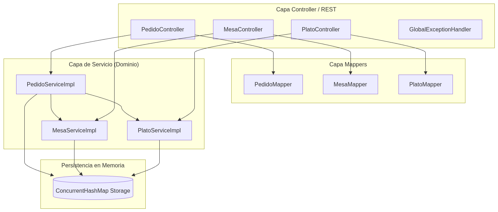
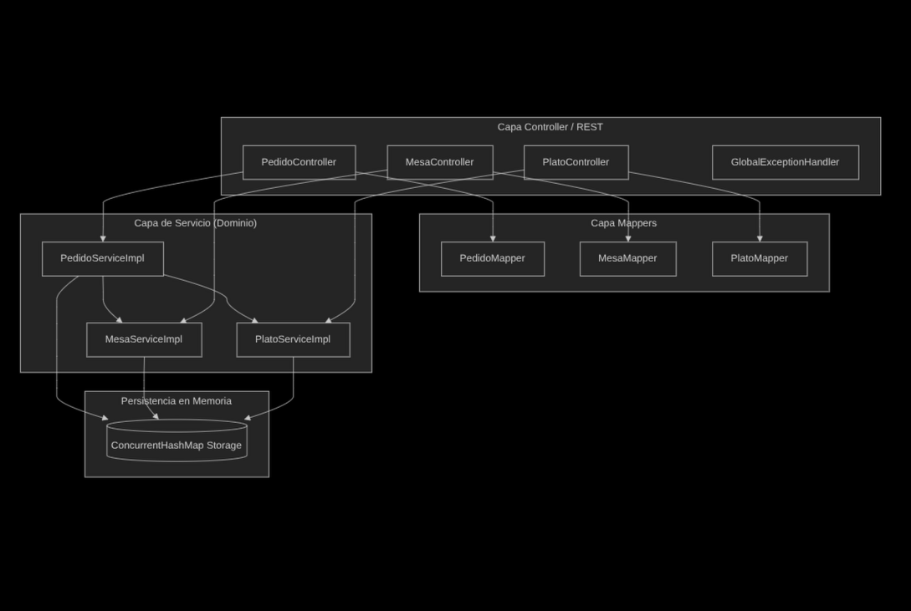
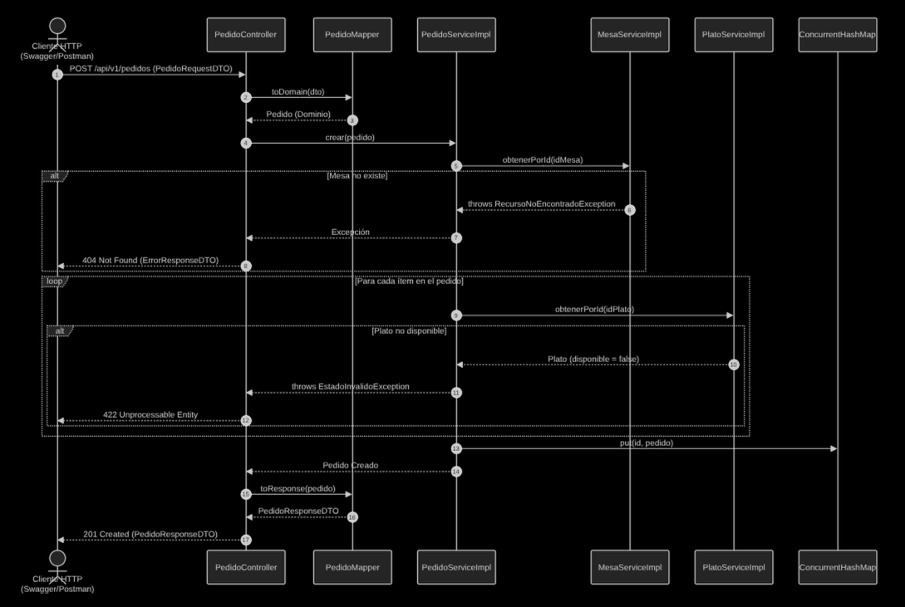
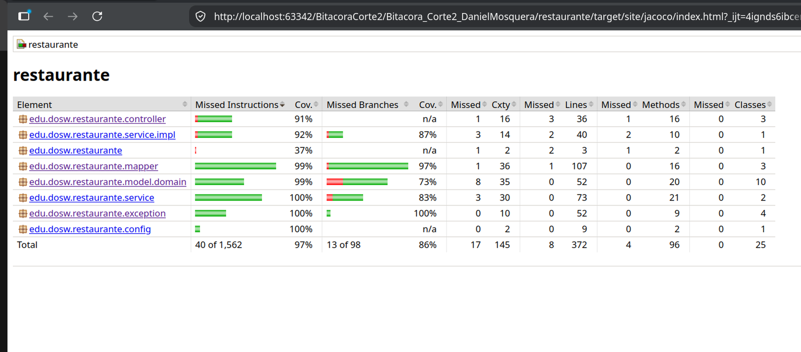
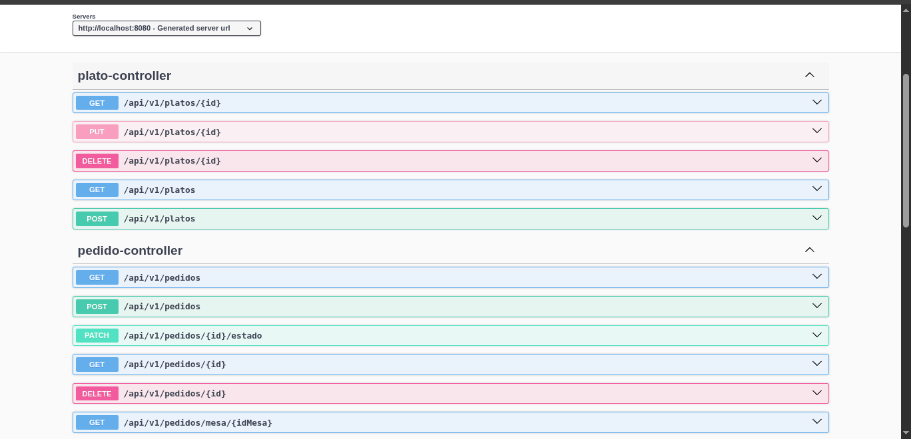
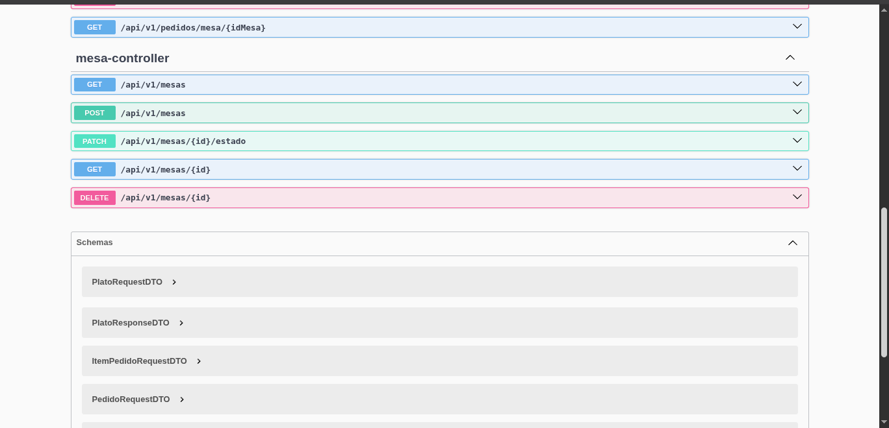
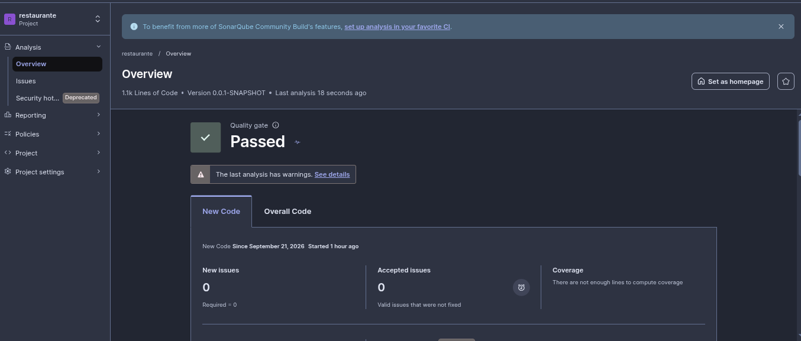

# Sakura Sushi

* **Autor:** Daniel Mosquera
* **Materia:** DOSW - Bitácora Corte 2
* **Concepto:** Japones

---

## Tecnologías y Herramientas

* **Lenguaje & Framework:** Java 21, Spring Boot 3.3.x
* **Arquitectura & Diseño:** Arquitectura en capas, Modelo de Dominio Puro
* **Herramientas de Construcción:** Apache Maven
* **Mapeo y Boilerplate:** Lombok, MapStruct
* **Documentación Interactiva:** Springdoc OpenAPI / Swagger UI
* **Pruebas Unitarias & Mocks:** JUnit 5, Mockito
* **Calidad y Cobertura:** JaCoCo, SonarQube / SonarLint
* **Persistencia:** En memoria utilizando `ConcurrentHashMap` y procesado con **Java Streams**

---

## 📋 Funcionalidades y Tabla de Endpoints

| Módulo | Método | Endpoint | Descripción | Estado Exitoso |
| :--- | :--- | :--- | :--- | :--- |
| **Platos** | `GET` | `/api/v1/platos` | Obtener catálogo completo de platos | `200 OK` |
| **Platos** | `GET` | `/api/v1/platos/{id}` | Obtener plato por su ID | `200 OK` |
| **Platos** | `POST` | `/api/v1/platos` | Registrar un nuevo plato en el menú | `201 Created` |
| **Platos** | `PUT` | `/api/v1/platos/{id}` | Actualizar datos de un plato existente | `200 OK` |
| **Platos** | `DELETE` | `/api/v1/platos/{id}` | Eliminar un plato por ID | `204 No Content` |
| **Mesas** | `GET` | `/api/v1/mesas` | Listar todas las mesas del restaurante | `200 OK` |
| **Mesas** | `POST` | `/api/v1/mesas` | Registrar una nueva mesa | `201 Created` |
| **Mesas** | `PATCH` | `/api/v1/mesas/{id}/estado` | Cambiar el estado de ocupación de una mesa | `200 OK` |
| **Pedidos** | `GET` | `/api/v1/pedidos` | Obtener historial de pedidos | `200 OK` |
| **Pedidos** | `POST` | `/api/v1/pedidos` | Crear un nuevo pedido asociando mesa e ítems | `201 Created` |
| **Pedidos** | `PATCH` | `/api/v1/pedidos/{id}/estado` | Transicionar el estado del pedido | `200 OK` |

---
## Diagramas UML
### Clases

### Componentes

### Secuencias

### JaCoCo

### Swagger

### Sonar
